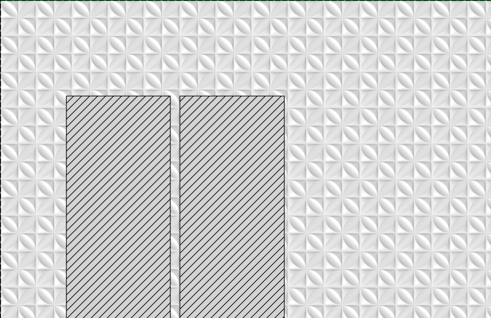
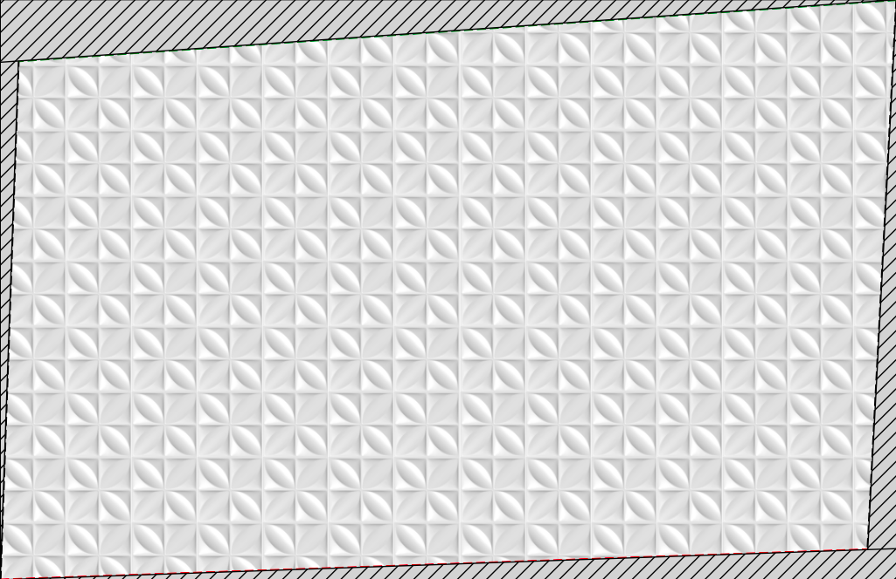

# Simulador de Instalação de Placas em Parede

<p align="center">
  
  
  
</p>

Este projeto permite simular visualmente a instalação de placas retangulares em uma parede, levando em consideração inclinações (prumos e níveis) e adicionando interatividade com o mouse para reposicionamento das placas.

## Recursos

* Geração automática de layout de placas baseado nas dimensões da parede.
* Possibilidade de adicionar uma imagem para representar cada placa.
* Simulação de **prumo esquerdo/direito** e **nível superior/inferior** com ângulos configuráveis.
* Áreas inclinadas hachuradas para facilitar a visualização de cortes.
* Placas e imagens associadas **podem ser arrastadas com o mouse** para simular ajustes manuais.

## Exemplo de Uso

```python
desenhar_parede_com_placas_e_objetos(
    largura_parede=4.1,
    altura_parede=2.66,
    tamanho_placa_largura=0.30,
    tamanho_placa_altura=0.30,
    imagem_placa='placa.png',
    prumo_offset_esquerda=2,
    prumo_offset_direita=3,
    prumo_inicio_esquerda='baixo',
    prumo_inicio_direita='cima',
    nivel_offset_cima=4,
    nivel_offset_baixo=2,
    nivel_inicio_cima='direita',
    nivel_inicio_baixo='esquerda'
)
```

## Dependências

* `matplotlib`
* `numpy`
* `opencv-python`

Instale as dependências com:

```bash
pip install matplotlib numpy opencv-python
```

## Como funciona

O script monta uma grade de placas e permite a visualização com variações nos níveis e prumos. Utilizando eventos do `matplotlib`, você pode clicar e arrastar as placas (e suas imagens associadas) diretamente no gráfico.

## Executando via Jupyter Notebook

Se quiser rodar e ajustar parâmetros de forma iterativa:

```bash
pip install notebook
jupyter notebook
```

Crie um novo notebook e copie o código para interagir graficamente com as placas.

## Licença

Este projeto está licenciado sob a licença MIT.
